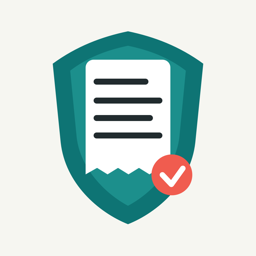
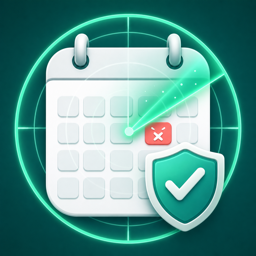
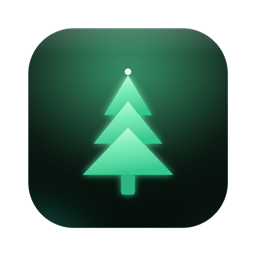

# My Apps — Privacy-First Utilities, Puzzles & Productivity Apps

Seven independent, privacy-first apps for iPhone and Mac—made for users across North America, the United Kingdom, Europe, Australia, and other international markets. The collection includes a receipt and warranty tracker, calendar spam cleaner, daily logic games, a connect-the-dots puzzle, a private Mac disk cleaner, a fragrance collection organizer, and a habit-and-goal tracker.

## Apps at a Glance

| Icon | App | Platform | What it does | Download |
| :---: | --- | :---: | --- | :---: |
|  | **ReceiptGuard: Returns** | iOS / iPhone | Receipt, return deadline, and warranty tracker | [App Store](https://apps.apple.com/app/id6791833165) |
|  | **CalendarKiller** | iOS / iPhone | Calendar spam, suspicious invitation, and duplicate-event cleaner | [App Store](https://apps.apple.com/app/id6787564566) |
|  | **Trio: Daily Logic Puzzles** | iOS / iPhone | Three fresh, hand-verified logic puzzles every day | [App Store](https://apps.apple.com/app/id6791609588) |
|  | **Knots: Connect Puzzle** | iOS / iPhone | A cozy connect-the-dots and fill-the-grid puzzle | [App Store](https://apps.apple.com/app/id6790466420) |
|  | **Spruce: Disk Cleanup** | macOS / Mac | Private disk-space analyzer, junk cleaner, and app uninstaller | [Mac App Store](https://apps.apple.com/app/id6794152421) |
|  | **Scentory: Fragrance Wardrobe** | iOS / iPhone | Perfume and fragrance collection organizer | [App Store](https://apps.apple.com/app/id6793348562) |
|  | **Daily Quest: Habit & Goals** | iOS / iPhone | Habit tracker, goal planner, streaks, and Live Activities | [App Store](https://apps.apple.com/app/id6797427767) |

## ReceiptGuard: Returns

### Receipt, Return & Warranty Tracker for iPhone

ReceiptGuard keeps your proof of purchase ready for returns, repairs, replacements, and warranty claims. Save receipt and product photos, return dates, warranty dates, serial numbers, and product details in one organized place. Local reminders help you act before a deadline, while search and status filters make old purchases easy to find.

With ReceiptGuard Pro, receipt details can be recognized on-device and purchase records can be exported as shareable PDFs. No account is required; data is stored locally by default, with optional private iCloud sync.

[Download ReceiptGuard: Returns on the App Store](https://apps.apple.com/app/id6791833165) · [Project folder](receiptguard/)

## CalendarKiller

### Remove Calendar Spam, Fake Invitations & Duplicate Events

CalendarKiller scans Apple Calendar data on your device and groups suspicious events, spam-like invitations, duplicate events, and subscribed-calendar items for review. Choose a recommended range, the past year, or a custom date range, then approve exactly what should be removed.

Calendar data is never uploaded. There is no account and no analytics. Scanning and review are free, including removal of up to 10 events; unlimited cleanup is available separately.

[Download CalendarKiller on the App Store](https://apps.apple.com/app/id6787564566) · [Project folder](calendar/CalendarKiller/)

## Trio: Daily Logic Puzzles

### Three Daily Brain Teasers — Trace, Lumen & Crowns

Trio is a daily puzzle habit that fits into a coffee break. Everyone receives the same three puzzles each day:

- **Trace:** draw one path through every numbered cell.
- **Lumen:** balance suns and moons while following line and clue rules.
- **Crowns:** place one crown in each row, column, and color region without touching.

Every puzzle is verified to have exactly one solution. Trio includes streaks, solve times, personal bests, shareable result cards, practice mode, hints, and private iCloud progress sync. Core play works offline with no account, ads, or tracking. The daily puzzles are free; an optional one-time Pro unlock expands the archive, practice, hints, and statistics.

[Download Trio: Daily Logic Puzzles on the App Store](https://apps.apple.com/app/id6791609588) · [Project folder](game/trio/)

## Knots: Connect Puzzle

### A Cozy Connect-the-Dots Logic Game

Knots is a relaxing flow-style puzzle: connect every matching pair of colored dots without crossing lines, while filling the entire grid. There are no timers and no pressure—just a quiet board and the satisfaction of making every connection fit.

Play through 999 hand-tuned levels from 5×5 to 12×12, take on the same Daily Challenge as everyone else, build a streak, use gentle hints, and play offline. An optional one-time Knots Pro purchase unlocks all levels, unlimited hints, Endless Mode, and future updates. There are no ads or subscriptions.

[Download Knots: Connect Puzzle on the App Store](https://apps.apple.com/app/id6790466420) · [Project folder](game/killAI/)

## Spruce: Disk Cleanup

### A Free, Private & Honest Mac Cleaner

Spruce shows exactly what is using your Mac storage and lets you clean only what you approve. It finds caches, logs, diagnostic reports, large media files, exact duplicates, application leftovers, startup items, and developer files from tools such as Xcode, npm, CocoaPods, and Homebrew.

Spruce works entirely on your Mac with no account, ads, subscription, analytics, or network access. Nothing is deleted without review, protected paths and running apps are skipped, and removed files go to the Trash so they remain recoverable.

[Download Spruce: Disk Cleanup on the Mac App Store](https://apps.apple.com/app/id6794152421) · [Project folder](Spruce/)

## Scentory: Fragrance Wardrobe

### Your Private Perfume & Cologne Collection Organizer

Scentory gives every perfume and cologne in your collection a beautiful home. Catalog bottles with photos, fragrance houses, accords, sizes, star ratings, and fill levels. Search and sort your wardrobe, record a scent of the day in one tap, keep a wishlist, and look back through your wear history.

Create shareable cards for individual fragrances, your Top 5, or monthly favorites. Collection data stays on your device with no account, tracking, ads, or sales catalog. Optional Pro access is offered as a yearly subscription or lifetime purchase, and eligible shares can unlock full access for 24 hours.

[Download Scentory: Fragrance Wardrobe on the App Store](https://apps.apple.com/app/id6793348562) · [Project folder](Scentory/)

## Daily Quest: Habit & Goals

### Habit Tracker, Goal Planner & Mochi Growth Journey

Daily Quest turns daily progress into a visible growth journey. Create recurring habits that repeat daily, on selected weekdays, or every few days. For finite goals, create an expedition with a target and deadline, then move it forward one step at a time. Each action helps Mochi grow and brings new life to Mochi World.

Track streaks, achievements, calendars, and progress rings; receive local reminders; create milestone share cards; and see today's tasks through Live Activities on the Lock Screen and Dynamic Island. Daily Quest has no account, server, ads, or in-app purchases—your tasks and progress stay on your device.

[Download Daily Quest: Habit & Goals on the App Store](https://apps.apple.com/app/id6797427767) · [Project folder](DailyQuest/)

## Privacy at a Glance

Privacy is a shared design principle across these apps. CalendarKiller, Knots, Spruce, Scentory, and Daily Quest keep their working data on the device. ReceiptGuard uses local storage by default with optional private iCloud sync, while Trio offers private iCloud progress sync. See each App Store listing and in-app privacy policy for complete, current details.

---

Search topics: iOS apps, macOS apps, indie apps, privacy-first apps, receipt tracker, warranty tracker, return reminder, calendar spam remover, calendar virus cleaner, daily logic puzzle, connect puzzle, flow puzzle, Mac cleaner, disk cleanup, app uninstaller, perfume collection, fragrance wardrobe, scent tracker, habit tracker, goal planner, streak tracker, Live Activities, iPhone apps, Mac App Store.
